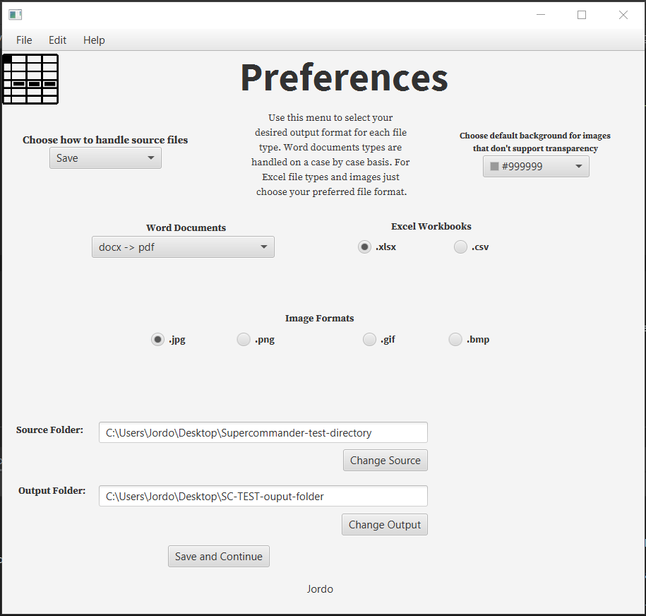
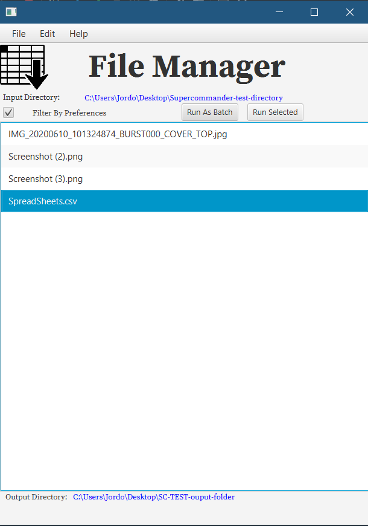

# _SuperCommander_v2.0.0_
 ### This is a new version of the SuperCommander project. Contributions welcome.
## _[Click Here For SuperCommander_v1.0.0](https://www.github.com/harrydulaney/super-commander)_
 
*__New features in process include:__*
 * __Batch converting all files users SuperCommander directory__
 * __Style options including dark mode via. multiple stylesheets (CSS)__
 * __Support for several new file types__
 

</image> 
</image>
  

